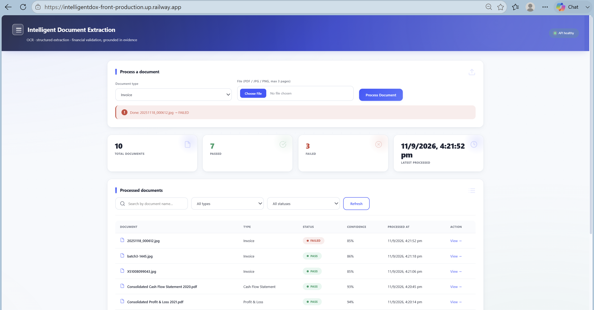
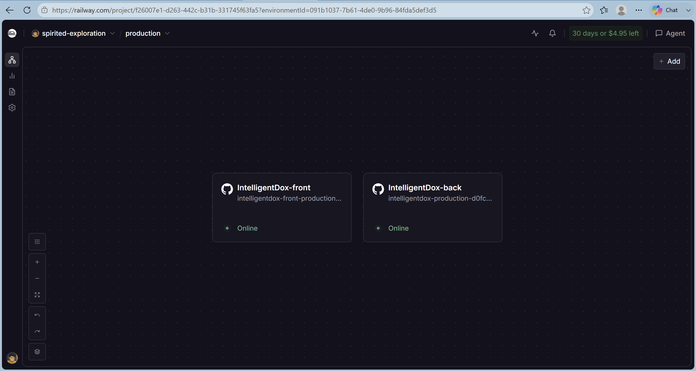
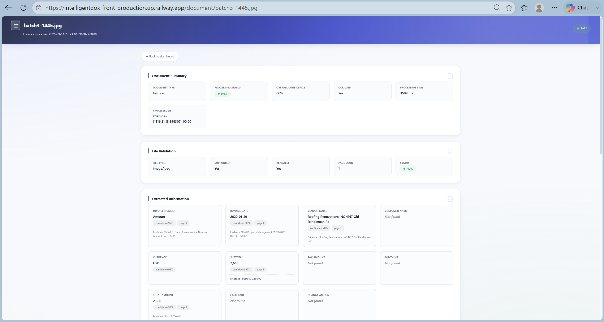
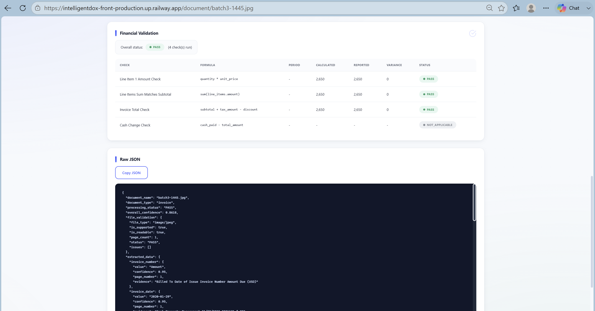
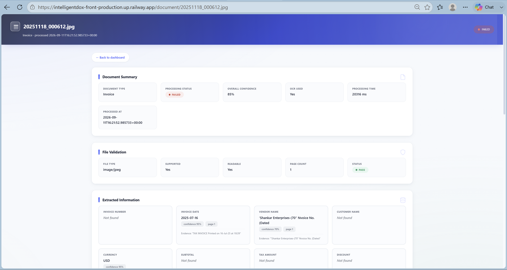
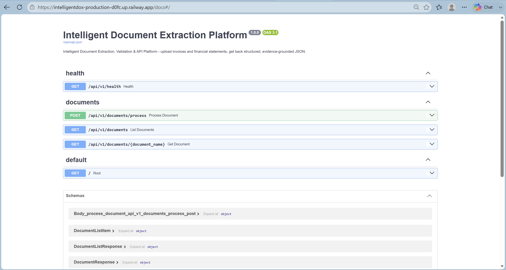

# IntelligentDox

### Intelligent Document Extraction, Validation & API Platform

[](https://www.python.org/)
[](https://fastapi.tiangolo.com/)
[](https://flask.palletsprojects.com/)
[](https://www.docker.com/)
[](https://www.postgresql.org/)
[](https://github.com/tesseract-ocr/tesseract)
[](#)

**IntelligentDox** is an end-to-end document intelligence platform for extracting, validating, and serving structured information from invoices and financial statements.

The platform accepts **PDF, JPG, and PNG** documents, combines native PDF extraction with **Tesseract OCR**, reconstructs financial table rows from OCR bounding boxes, produces **evidence-grounded structured JSON**, and independently recomputes financial relationships to determine whether extracted figures are internally consistent.

> Built for the **Intelligent Document Extraction, Validation & API Platform** AI Engineer internship case study.

## 🌐 Live Demo

**Frontend:**  
https://intelligentdox-front-production.up.railway.app/


| **Swagger / OpenAPI** | [Interactive API Documentation](https://intelligentdox-production-d0fc.up.railway.app/docs) |

| **Health Check** | [IntelligentDox Health](https://intelligentdox-production-d0fc.up.railway.app/api/v1/health) |

| **Backend API** | [IntelligentDox API](https://intelligentdox-production-d0fc.up.railway.app/) |

| **Example Document Result** | [Consolidated Cash Flow Statement 2020](https://intelligentdox-front-production.up.railway.app/document/Consolidated%20Cash%20Flow%20Statement%202020.pdf) |

| **GitHub Repository** | https://github.com/nishant-cipher/IntelligentDox |

The application is deployed on **Railway** using separate containerized backend and frontend services.

> **Note:** The backend public URL is intentionally not hardcoded here until it is finalized. The frontend communicates with the deployed backend through the `BACKEND_URL` environment variable.

---
## 📸 Application Screenshots

### Processed Documents Dashboard

The dashboard maintains a view of processed documents, including document type, processing status, confidence, timestamps, and result access.



### Deployment Dashboard

The deployed IntelligentDox dashboard provides document upload, document-type selection, processing statistics, confidence scores, status tracking, search/filtering, and access to previously processed documents.



---

### Document Extraction & Evidence

The document result page displays structured extracted information along with confidence scores, page references, and supporting OCR evidence for extracted fields.



---

### Financial Validation & JSON Output

Financial relationships are validated using configurable rules and tolerances. The result page also exposes the structured JSON response containing extraction results, confidence, evidence, file validation, and validation calculations.



---

### Validation Failure Scenario

IntelligentDox also handles documents that fail validation, allowing mismatches and processing outcomes to be surfaced instead of silently accepting incorrect results.



---

### Swagger / OpenAPI

The deployed backend exposes interactive Swagger/OpenAPI documentation for testing and exploring the REST API endpoints.



---


---
## ✨ Key Features

- 📄 **Multi-format document ingestion** — PDF, JPG, and PNG
- 🔍 **Layered OCR pipeline** — native PDF text first, Tesseract fallback for scanned documents
- 📐 **Table-aware OCR reconstruction** using word-level bounding boxes
- 🧠 **Deterministic document extraction** using regex and structural heuristics
- 🧾 **Four supported document types**
  - Invoice
  - Balance Sheet
  - Profit & Loss Statement
  - Cash Flow Statement
- 🎯 **Evidence-grounded extraction** — important fields include confidence, page number, and source evidence
- 🧮 **Independent financial validation** — extracted numbers are recomputed instead of blindly trusted
- ✅ **PASS / FAIL / NOT_APPLICABLE** validation states
- 🗄️ **SQLAlchemy persistence** with SQLite locally and PostgreSQL support for production
- 🌐 **Versioned REST API** with interactive Swagger documentation
- 🖥️ **Web dashboard** for upload, processing, validation results, and raw JSON
- 🤖 **Optional Anthropic LLM gap-fill** — deterministic extraction remains the primary path
- 🐳 **Dockerized architecture** with independent backend and frontend containers
- 🧪 **Automated test suite** covering validation, extraction, and API behavior

---

# 📋 Table of Contents

- [Problem Statement](#-problem-statement)
- [How It Works](#-how-it-works)
- [Architecture](#-architecture)
- [Technology Stack](#-technology-stack)
- [Supported Documents](#-supported-documents)
- [OCR Pipeline](#-ocr-pipeline)
- [Extraction Engine](#-extraction-engine)
- [Financial Validation](#-financial-validation)
- [API](#-api)
- [Dataset](#-dataset)
- [Results](#-results)
- [Project Structure](#-project-structure)
- [Local Setup](#-local-setup)
- [Docker](#-docker)
- [Railway Deployment](#-railway-deployment)
- [Environment Variables](#-environment-variables)
- [Testing](#-testing)
- [Known Limitations](#-known-limitations)
- [Future Improvements](#-future-improvements)
- [AI-Assisted Development](#-ai-assisted-development)

---

# 🎯 Problem Statement

Organizations process large volumes of invoices and financial statements in the form of scanned PDFs, photographed documents, and digital files.

Traditional manual data entry is:

- slow,
- expensive,
- difficult to scale,
- and vulnerable to transcription errors.

A basic **OCR → JSON** pipeline solves only the extraction problem. It does not answer the more important question:

> **Are the numbers extracted from the document internally consistent?**

IntelligentDox addresses both problems:

```text
Document
   ↓
File Validation
   ↓
Text Extraction / OCR
   ↓
Structured Data Extraction
   ↓
Evidence + Confidence
   ↓
Independent Financial Validation
   ↓
Persistent Result
   ↓
REST API + Dashboard
```

The implementation is deliberately **dataset-independent**. It does not hardcode individual documents and uses the same processing architecture across invoices, balance sheets, P&L statements, and cash flow statements.

---

# ⚙️ How It Works

### 1. Upload

The user selects a document type and uploads a PDF, JPG, or PNG.

Maximum PDF length: **3 pages**.

### 2. File Validation

The backend validates:

- file type,
- content signature / magic bytes,
- file integrity,
- readability,
- page count,
- configured size limits.

Filename extensions alone are not trusted.

### 3. Text Extraction

For PDFs:

1. PyMuPDF attempts native text extraction.
2. A quality check determines whether the extracted text is usable.
3. If the document is scanned or the text quality is insufficient, the page is rendered at **300 DPI**.
4. Tesseract OCR processes the rendered image.

Images go directly through the OCR pipeline.

### 4. Table Reconstruction

OCR word-level bounding boxes are used to reconstruct rows based on vertical position and then sort words left-to-right.

This is particularly important for financial statements where a naive OCR text stream can separate labels and numeric columns.

### 5. Structured Extraction

Document-specific extraction logic converts OCR/native text into structured fields and financial line items.

Each important field can carry:

```json
{
  "value": "...",
  "confidence": 0.95,
  "page_number": 1,
  "evidence": "..."
}
```

The system does not fabricate missing values.

### 6. Independent Validation

The validation engine receives the extracted numbers and independently recomputes financial formulas.

Example:

```text
Interest Earned + Other Income
              ↓
       Calculated Total
              ↓
     Compare with Reported Total
              ↓
       PASS / FAIL
```

### 7. Persistence & API

The processing result is stored through SQLAlchemy and exposed through a versioned REST API.

### 8. Dashboard

The Flask dashboard provides:

- document upload,
- processing status,
- PASS / FAILED visibility,
- extracted fields,
- financial line items,
- validation checks,
- raw JSON results.

---

# 🏗️ Architecture

```text
                         ┌──────────────────────────┐
                         │       Web Dashboard      │
                         │    Flask + Jinja2 + JS   │
                         └────────────┬─────────────┘
                                      │
                                  HTTP / API
                                      │
                                      ▼
                         ┌──────────────────────────┐
                         │       FastAPI Backend    │
                         │        /api/v1           │
                         └────────────┬─────────────┘
                                      │
                    ┌─────────────────┴─────────────────┐
                    │                                   │
                    ▼                                   ▼
          ┌────────────────────┐              ┌────────────────────┐
          │ Document Validation│              │ Text / OCR Service │
          │                    │              │                    │
          │ Type / MIME /      │              │ PyMuPDF            │
          │ Integrity / Pages  │              │ Tesseract fallback │
          └─────────┬──────────┘              └─────────┬──────────┘
                    │                                   │
                    └─────────────────┬─────────────────┘
                                      ▼
                         ┌──────────────────────────┐
                         │ Structured Extraction    │
                         │                          │
                         │ Regex + heuristics +    │
                         │ OCR table reconstruction│
                         └────────────┬─────────────┘
                                      │
                                      ▼
                         ┌──────────────────────────┐
                         │ Financial Validation     │
                         │                          │
                         │ Formula recomputation   │
                         │ + tolerance comparison  │
                         └────────────┬─────────────┘
                                      │
                                      ▼
                         ┌──────────────────────────┐
                         │ Document Repository      │
                         │                          │
                         │ SQLAlchemy               │
                         │ SQLite / PostgreSQL      │
                         └────────────┬─────────────┘
                                      │
                                      ▼
                         ┌──────────────────────────┐
                         │ Structured JSON Response │
                         └──────────────────────────┘
```

Architecture diagram: [`docs/architecture.png`](docs/architecture.png)

---

# 🧰 Technology Stack

| Layer | Technology |
|---|---|
| Backend | FastAPI + Uvicorn |
| API Schemas | Pydantic v2 |
| ORM | SQLAlchemy 2.0 |
| Local Database | SQLite |
| Production Database | PostgreSQL |
| PDF Processing | PyMuPDF |
| OCR | Tesseract + pytesseract |
| Image Processing | Pillow |
| Frontend | Flask + Jinja2 |
| Frontend UI | HTML + CSS + Vanilla JavaScript |
| Optional LLM | Anthropic SDK |
| Testing | pytest + FastAPI TestClient |
| Containerization | Docker + Docker Compose |
| Cloud Deployment | Railway |

### Why this stack?

**FastAPI** provides automatic OpenAPI/Swagger documentation, typed request/response models, and clean dependency injection.

**PyMuPDF** provides fast native PDF text extraction and page rendering without requiring an external Poppler dependency.

**Tesseract** provides local, open-source OCR and word-level bounding boxes used by the table reconstruction algorithm.

**SQLAlchemy** abstracts the database layer so SQLite can be used locally while PostgreSQL can be used in production.

**Flask** keeps the frontend lightweight and aligned with the requirement for HTML/CSS/JavaScript rather than a heavy frontend framework.

---

# 📄 Supported Documents

| Document Type | Dataset | Supported |
|---|---:|:---:|
| Balance Sheet | 10 | ✅ |
| Cash Flow Statement | 10 | ✅ |
| Profit & Loss | 10 | ✅ |
| Invoice | 20 | ✅ |
| **Total** | **50** | **✅** |

The dataset contains:

```text
dataset/
├── Balance Sheet/       10 scanned PDFs (2017–2026)
├── Cash Flows/          10 scanned PDFs (2017–2026)
├── Profit & Loss/       10 scanned PDFs (2017–2026)
└── Invoices/            20 photographed/scanned JPGs
```

A detailed dataset investigation is available in:

[`docs/dataset_analysis.md`](docs/dataset_analysis.md)

The analysis was generated by running the application's OCR pipeline against the dataset rather than manually entering observations.

---

# 🔍 OCR Pipeline

The OCR system uses a layered strategy:

```text
                    PDF
                     │
                     ▼
              PyMuPDF get_text()
                     │
              Quality sufficient?
                /          \
              YES           NO
               │             │
               ▼             ▼
          Native text    Render @ 300 DPI
                             │
                             ▼
                         Tesseract
                             │
                             ▼
                  Word-level bounding boxes
                             │
                             ▼
                    Row reconstruction
```

## Table-aware row reconstruction

A major challenge with financial statements is that standard OCR output does not necessarily preserve the logical row structure of a table.

The implementation therefore:

1. captures every OCR word's bounding box,
2. clusters words using vertical position,
3. sorts words left-to-right,
4. reconstructs logical rows,
5. exposes the reconstructed content to the extraction engine.

For example:

```text
Capital        1       1,539.34       765.22
```

can be reconstructed as a single financial row instead of being separated into unrelated OCR blocks.

## Image orientation

Phone photographs can store rotation in EXIF metadata rather than physically rotating the pixels.

The pipeline applies EXIF orientation correction before OCR to prevent rotated invoices from producing unusable OCR output.

---

# 🧠 Extraction Engine

The primary extraction engine is **deterministic and rule-based**.

It uses:

- regular expressions,
- aliases,
- number normalization,
- financial-table parsing,
- OCR row reconstruction,
- document-type-specific heuristics.

### Number normalization

The parser handles explicit conventions such as:

- thousands separators,
- parentheses/brackets for negative values,
- currency symbols and codes,
- crore,
- lakh,
- million,
- thousand,
- `'000` notation.

Scaling is only applied when the document explicitly indicates the scale.

### Evidence grounding

Important extracted fields retain:

```text
value
confidence
page_number
evidence
```

If a value cannot be reliably extracted, it is returned as `null` instead of being guessed.

### Optional LLM support

Anthropic can optionally provide an additional extraction/gap-fill pass.

It is **not required** for the core pipeline.

```text
LLM_PROVIDER=none
```

keeps the system fully deterministic.

---

# 🧮 Financial Validation

The validation engine is intentionally separated from OCR and extraction.

It operates only on already-extracted numerical values.

## Invoice

```text
quantity × unit_price ≈ amount
sum(line items) ≈ subtotal
subtotal + tax − discount ≈ total
cash_paid − total ≈ change
```

## Balance Sheet

```text
Total Capital & Liabilities ≈ Total Assets
```

Additional component checks are performed when sufficient line items are available.

## Profit & Loss

```text
Interest Earned + Other Income ≈ Total Income

Interest Expended + Operating Expenses + Provisions
≈ Total Expenditure

Total Income − Total Expenditure
≈ Net Profit before Minority Interest

Profit before MI − Minority Interest
≈ Net Profit attributable to Group

Current Profit + Brought Forward
≈ Total Available for Appropriation
```

A generic:

```text
Revenue − Cost of Sales ≈ Gross Profit
```

check is also supported for non-bank-format P&Ls.

## Cash Flow

```text
Operating + Investing + Financing + FX
≈ Net Increase in Cash

Opening Cash + Net Increase
≈ Closing Cash
```

## Validation tolerance

```text
VALIDATION_ABSOLUTE_TOLERANCE=1.0
VALIDATION_RELATIVE_TOLERANCE=0.01
```

A check passes when either tolerance is satisfied.

This accommodates rounding in financial statements.

### Validation states

| Status | Meaning |
|---|---|
| `PASS` | Calculated and reported values reconcile |
| `FAIL` | A required financial relationship does not reconcile |
| `NOT_APPLICABLE` | Required operand is unavailable |

The system never converts missing information into a fabricated PASS.

---

# 🔌 REST API

Base path:

```text
/api/v1
```

Interactive API documentation:

```text
/docs
```

## Endpoints

| Method | Endpoint | Description |
|---|---|---|
| `POST` | `/api/v1/documents/process` | Upload and process a document |
| `GET` | `/api/v1/documents` | List processed documents |
| `GET` | `/api/v1/documents/{document_name}` | Get latest result for a document |
| `GET` | `/api/v1/health` | Health check |

## Process a document

```bash
curl -X POST "http://localhost:8000/api/v1/documents/process" \
  -F "file=@dataset/Invoices/X51005361895.jpg" \
  -F "document_type=invoice"
```

Accepted document types:

```text
invoice
balance_sheet
profit_and_loss
cash_flow_statement
```

## Example response

```json
{
  "document_name": "Consolidated Balance Sheet 2026.pdf",
  "document_type": "balance_sheet",
  "processing_status": "PASS",
  "overall_confidence": 0.9446,
  "file_validation": {
    "file_type": "application/pdf",
    "is_supported": true,
    "is_readable": true,
    "page_count": 1,
    "status": "PASS",
    "issues": []
  },
  "extracted_data": {
    "company_name": {
      "value": "HDFC Bank Limited",
      "confidence": 0.95,
      "evidence": "HDFC Bank Limited"
    },
    "currency": {
      "value": "INR",
      "confidence": 0.95
    },
    "periods": ["2026", "2025"]
  },
  "validation": {
    "overall_status": "PASS",
    "issues": []
  },
  "processing_metadata": {
    "ocr_used": true,
    "ocr_provider": "tesseract",
    "extraction_provider": "rule_based"
  }
}
```

---

# 🗄️ Database

The application uses a repository-based persistence layer:

```text
API
 ↓
Document Service
 ↓
Document Repository
 ↓
SQLAlchemy
 ↓
SQLite / PostgreSQL
```

The main `documents` table stores:

- document name,
- document type,
- processing status,
- file type,
- page count,
- support/readability status,
- overall confidence,
- file validation result,
- extracted data,
- validation result,
- processing metadata,
- timestamps.

### Local

SQLite is used by default.

### Production

PostgreSQL is recommended for persistent cloud storage.

The database backend is selected through:

```text
DATABASE_URL
```

---

# 📁 Project Structure

```text
IntelligentDox/
│
├── backend/
│   ├── app/
│   │   ├── api/
│   │   ├── core/
│   │   ├── models/
│   │   ├── repositories/
│   │   ├── services/
│   │   ├── utils/
│   │   └── main.py
│   │
│   ├── tests/
│   ├── requirements.txt
│   └── Dockerfile
│
├── frontend/
│   ├── static/
│   ├── templates/
│   ├── frontend_app.py
│   ├── requirements.txt
│   └── Dockerfile
│
├── dataset/
├── docs/
├── sample_outputs/
├── scripts/
├── uploads/
│
├── .env.example
├── docker-compose.yml
└── README.md
```

---

# 💻 Local Setup

## Prerequisites

- Python 3.11+
- Tesseract OCR
- Git
- Docker (optional)

## 1. Clone the repository

```bash
git clone <your-repository-url>
cd IntelligentDox
```

## 2. Create a virtual environment

### Windows PowerShell

```powershell
py -m venv .venv
.\.venv\Scripts\Activate.ps1
```

### Windows CMD

```cmd
py -m venv .venv
.venv\Scripts\activate.bat
```

### macOS / Linux

```bash
python3 -m venv .venv
source .venv/bin/activate
```

## 3. Install backend dependencies

```bash
python -m pip install -r backend/requirements.txt
```

## 4. Install Tesseract

### Windows

```powershell
winget install --id UB-Mannheim.TesseractOCR -e
```

### macOS

```bash
brew install tesseract
```

### Debian / Ubuntu

```bash
sudo apt-get install tesseract-ocr
```

## 5. Configure environment

Copy:

```text
.env.example
```

to:

```text
backend/.env
```

Never commit a real `.env` file.

---

# ▶️ Running Locally

## Backend

```bash
cd backend
uvicorn app.main:app --reload --host 127.0.0.1 --port 8000
```

Backend:

```text
http://127.0.0.1:8000
```

Swagger:

```text
http://127.0.0.1:8000/docs
```

Health:

```text
http://127.0.0.1:8000/api/v1/health
```

## Frontend

Open a second terminal:

```powershell
cd frontend
$env:BACKEND_URL="http://localhost:8000"
python frontend_app.py
```

Dashboard:

```text
http://localhost:5000
```

---

# 🐳 Docker

The project contains independent Dockerfiles:

```text
backend/Dockerfile
frontend/Dockerfile
```

Run the complete local stack:

```bash
docker-compose up --build
```

Services:

```text
Frontend → http://localhost:5000
Backend  → http://localhost:8000
Swagger  → http://localhost:8000/docs
```

---

# ☁️ Railway Deployment

The production deployment uses **two independent Railway services** from the same GitHub repository.

## Backend service

Configure:

```text
Root Directory = /backend
```

Railway uses:

```text
backend/Dockerfile
```

Required production configuration includes:

```text
DATABASE_URL=<PostgreSQL connection string>
CORS_ORIGINS=<frontend public URL>
OCR_LANGUAGE=eng
```

The Docker image should provide the Linux Tesseract dependency.

## Frontend service

Configure:

```text
Root Directory = /frontend
```

Railway uses:

```text
frontend/Dockerfile
```

Set:

```text
BACKEND_URL=<deployed backend URL>
```

## Production architecture

```text
                  ┌─────────────────────┐
                  │       GitHub        │
                  │   IntelligentDox    │
                  └──────────┬──────────┘
                             │
                  ┌──────────┴──────────┐
                  │                     │
                  ▼                     ▼
       ┌──────────────────┐  ┌──────────────────┐
       │ Railway Backend  │  │ Railway Frontend │
       │                  │  │                  │
       │ /backend         │◄─┤ /frontend        │
       │ FastAPI          │  │ Flask            │
       │ Docker           │  │ Docker           │
       └────────┬─────────┘  └──────────────────┘
                │
                ▼
       ┌──────────────────┐
       │ Railway          │
       │ PostgreSQL       │
       └──────────────────┘
```

---

# 🔐 Environment Variables

| Variable | Purpose |
|---|---|
| `DATABASE_URL` | Database connection |
| `MAX_FILE_SIZE_MB` | Upload size limit |
| `MAX_PAGES` | Maximum PDF pages |
| `OCR_LANGUAGE` | Tesseract language |
| `TESSERACT_CMD` | Optional Tesseract executable path |
| `PDF_RENDER_DPI` | PDF-to-image rendering resolution |
| `OCR_MIN_TEXT_CHARS` | Native text quality threshold |
| `LLM_PROVIDER` | Optional LLM provider |
| `LLM_API_KEY` | Optional LLM API key |
| `LLM_MODEL` | Optional LLM model |
| `LLM_TIMEOUT_SECONDS` | LLM request timeout |
| `VALIDATION_ABSOLUTE_TOLERANCE` | Absolute financial tolerance |
| `VALIDATION_RELATIVE_TOLERANCE` | Relative financial tolerance |
| `CORS_ORIGINS` | Allowed frontend origins |
| `LOG_LEVEL` | Application logging level |

See [`.env.example`](.env.example) for the complete configuration.

---

# 🧪 Testing

Run the backend test suite:

```bash
cd backend
python -m pytest tests/ -v
```

The test suite covers:

- file type validation,
- file integrity,
- page-count rules,
- number parsing,
- currency/unit handling,
- document-specific extraction,
- financial validation,
- PASS / FAIL / NOT_APPLICABLE scenarios,
- API behavior,
- controlled error responses.

**48 automated tests** were passing during development.

---

# 📊 Dataset Results

The complete 50-file dataset was processed through the live API pipeline.

| Category | Files | PASS | FAILED |
|---|---:|---:|---:|
| Balance Sheet | 10 | 6 | 4 |
| Cash Flow Statement | 10 | 7 | 3 |
| Profit & Loss | 10 | 5 | 5 |
| Invoices | 20 | 9 | 11 |
| **Total** | **50** | **27 (54%)** | **23 (46%)** |

Importantly, the `FAILED` results were not application crashes.

They represented either:

- genuine financial mismatches, or
- insufficient extraction caused by low-quality scans/photos.

The pipeline produced a structured, inspectable response for all 50 documents rather than silently fabricating values.

---

# ⚠️ Known Limitations

### OCR quality

Poor scans can cause dropped or merged digits, directly limiting extraction accuracy.

### Comparative-year labels

OCR may occasionally misread a year label even when the corresponding financial values are correctly extracted.

### Photographed invoices

Skew, handwriting, stamps, overlapping text, and complex layouts make photographed invoices significantly harder than clean financial statements.

### Table structure

The current row reconstruction approach is geometric/heuristic rather than a dedicated table-structure model.

### LLM path

The optional Anthropic extraction path is implemented but was not exercised end-to-end during development because an API key was unavailable.

### File retention

Uploaded originals are temporary and are deleted after processing. Structured results are persisted.

---

# 🚀 Future Improvements

Potential production improvements include:

1. **Image preprocessing**
   - deskewing,
   - contrast normalization,
   - denoising,
   - upscaling.

2. **Layout-aware table extraction**
   - replace heuristic row clustering with a dedicated document/table understanding model.

3. **Authentication and authorization**
   - protect processing and document endpoints.

4. **Object storage**
   - S3-compatible storage for original documents when long-term retention is required.

5. **Asynchronous processing**
   - background workers / job queues for heavy OCR workloads.

6. **Improved invoice understanding**
   - better handling of HSN codes, GST columns, discounts, and complex line-item layouts.

---

# 🤖 AI-Assisted Development

The project was developed with assistance from **Claude Code**, particularly for:

- code generation,
- architecture and service separation,
- debugging,
- OCR pipeline improvements,
- table reconstruction,
- EXIF orientation handling,
- extraction-rule development,
- iterative testing,
- documentation.

AI assistance was used as a development tool; the resulting system was validated against the real project dataset and automated tests.

---

# 📚 Documentation

Additional project documentation:

- [`docs/architecture.png`](docs/architecture.png) — system architecture
- [`docs/dataset_analysis.md`](docs/dataset_analysis.md) — dataset and OCR analysis
- [`sample_outputs/`](sample_outputs/) — real pipeline output examples
- [`scripts/analyze_dataset.py`](scripts/analyze_dataset.py) — dataset analysis utility
- [`.env.example`](.env.example) — environment configuration reference

---

# ✅ Project Status

| Component | Status |
|---|:---:|
| Document upload | ✅ |
| File validation | ✅ |
| Native PDF extraction | ✅ |
| Tesseract OCR | ✅ |
| OCR table reconstruction | ✅ |
| Invoice extraction | ✅ |
| Balance Sheet extraction | ✅ |
| P&L extraction | ✅ |
| Cash Flow extraction | ✅ |
| Evidence + confidence | ✅ |
| Financial validation | ✅ |
| REST API | ✅ |
| Swagger documentation | ✅ |
| Flask dashboard | ✅ |
| SQLite local persistence | ✅ |
| PostgreSQL production support | ✅ |
| Docker backend | ✅ |
| Docker frontend | ✅ |
| Automated tests | ✅ |
| Railway deployment | ✅ |
| Public frontend | ✅ |

---

# 🌐 Live Application

**IntelligentDox:**  
https://intelligentdox-front-production.up.railway.app/

---

## 📌 Submission Checklist

- [x] Backend starts and exposes Swagger
- [x] Frontend communicates with backend
- [x] Health endpoint implemented
- [x] Four document types supported
- [x] Scanned PDFs supported
- [x] Photographed images supported
- [x] Financial validation implemented
- [x] Controlled API error responses
- [x] Automated tests
- [x] Dockerized backend
- [x] Dockerized frontend
- [x] Architecture documentation
- [x] Dataset analysis
- [x] Sample outputs
- [x] Public Railway deployment
- [x] Public frontend URL

---

<p align="center">
  <strong>IntelligentDox</strong><br>
  Document Intelligence • OCR • Financial Validation • REST API
</p>
